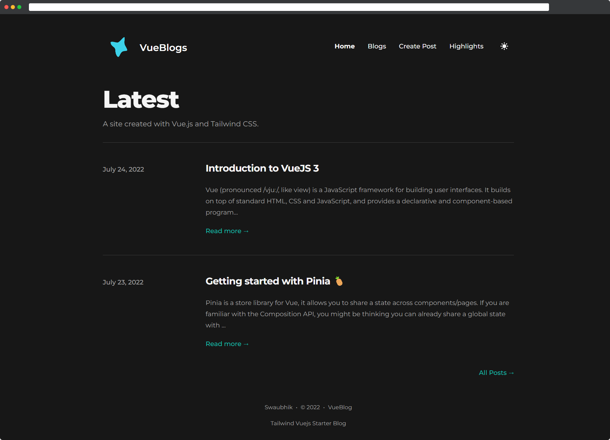
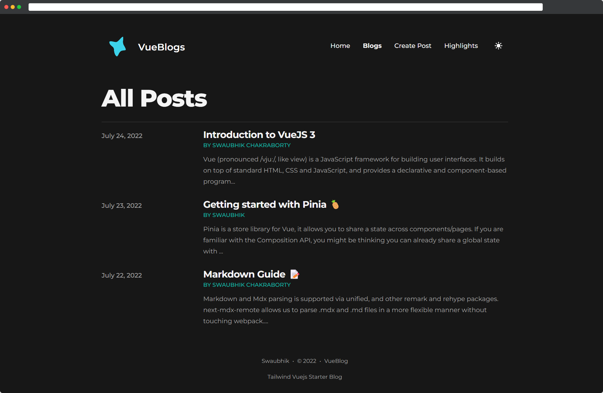
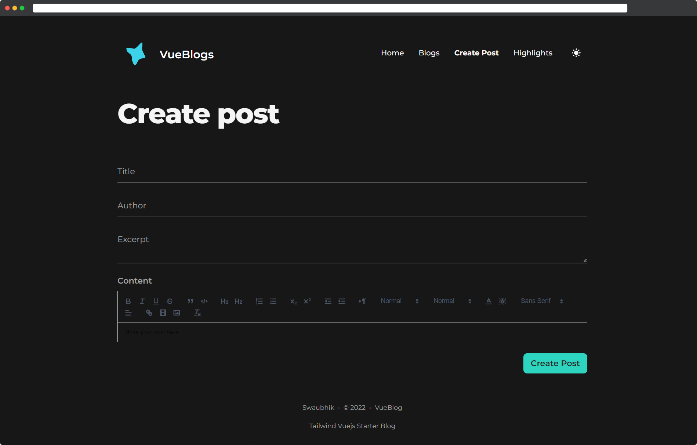
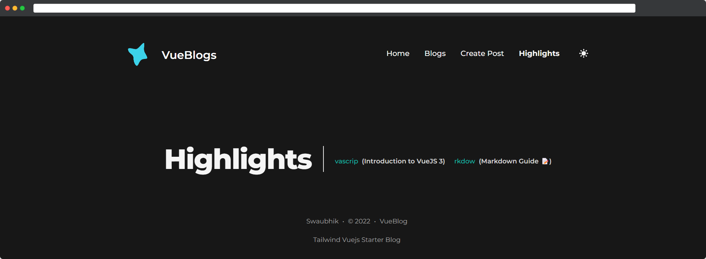
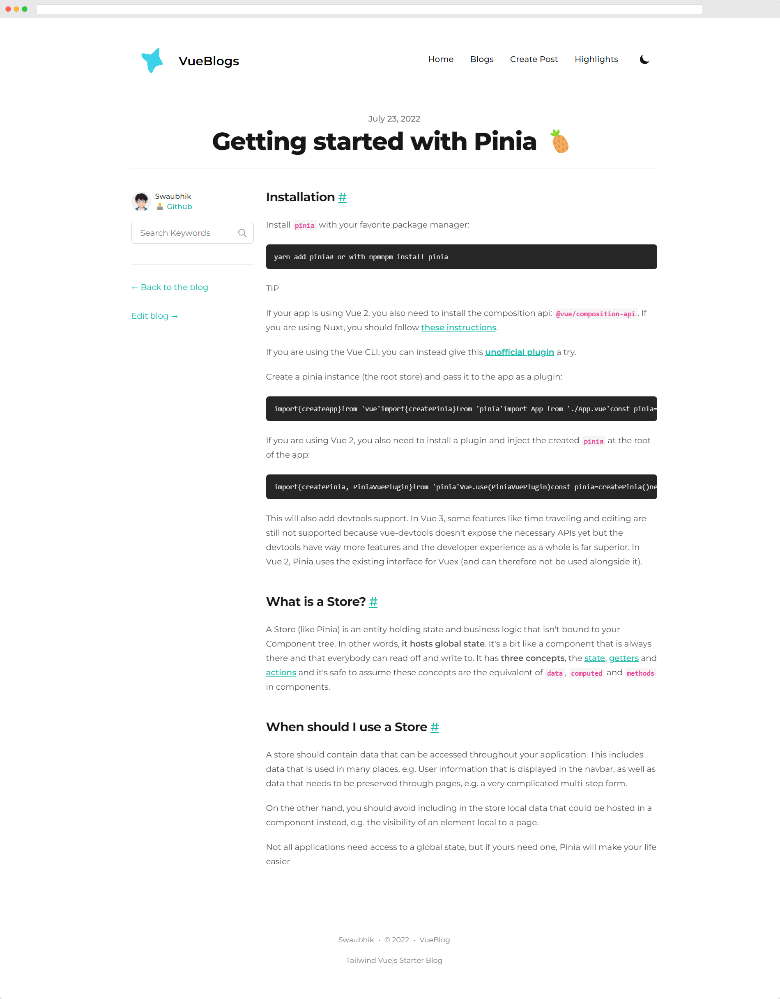
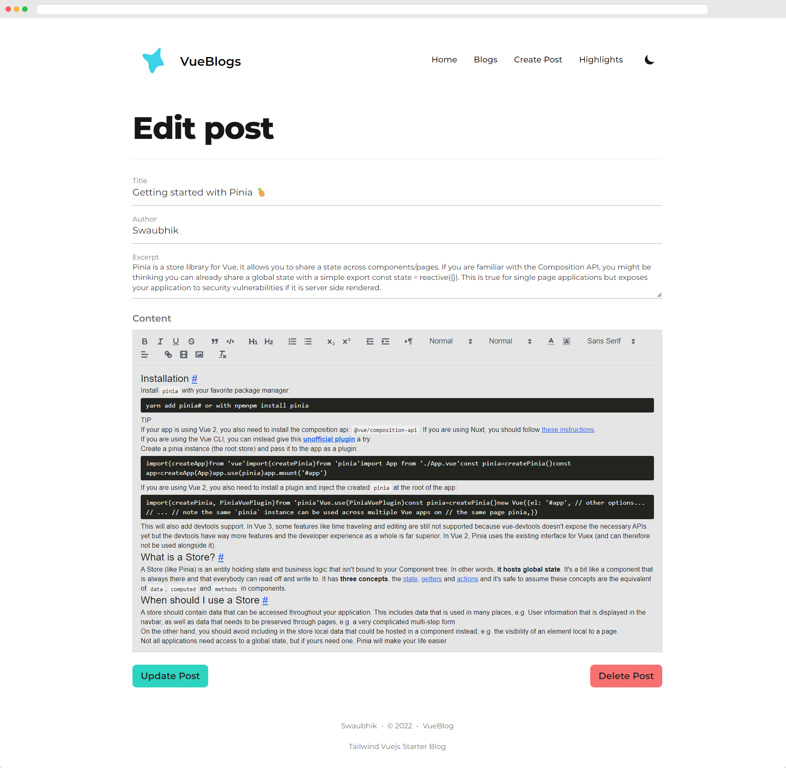
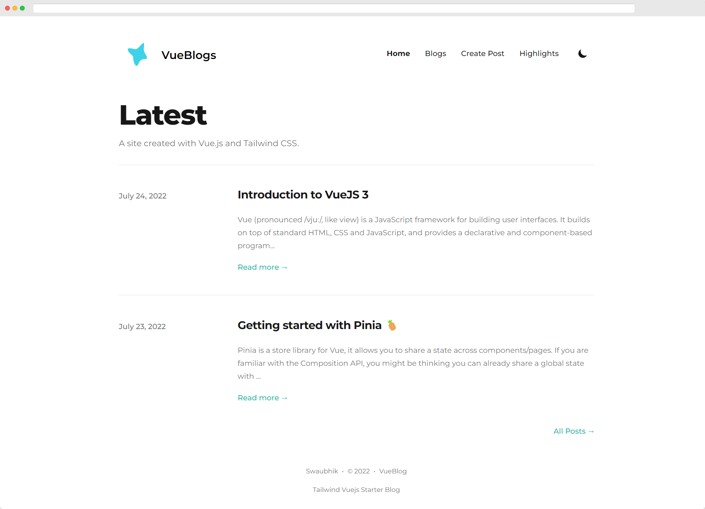

[](https://app.netlify.com/sites/swaubhik-sensehawk-assignment/deploys)

<p align="center">
  <a href="https://swaubhik-sensehawk-assignment.netlify.app/" target="_blank" rel="noopener noreferrer">
    
  </a>
</p>


# Vue Blog

A simple blog application using Vue.js and Netlify with medium like highlighting feature. This was crated as a part of the [SenseHawk's](https://sensehawk.com/) assignment.


## Demo

[swaubhik-sensehawk-assignment](https://swaubhik-sensehawk-assignment.netlify.app/)

## Screenshots

| | | |
|:-------------------------:|:-------------------------:|:-------------------------:|
|  Home |  Blog||
|Highlighting|  Blog Preview|Edit post|
| Light Mode| 
## Tech Stack

**Client:** Vue3, Pinia, TailwindCSS

**Server:** Node


## Run Locally

Clone the project

```sh
  git clone https://github.com/swaubhik/vue-blog.git
```

Go to the project directory

```sh
  cd vue-blog
```

Install dependencies

```sh
  yarn install or npm install
```

Start the development server

```bash
  yarn dev or npm run dev
```


## License

[MIT](./LICENSE)

